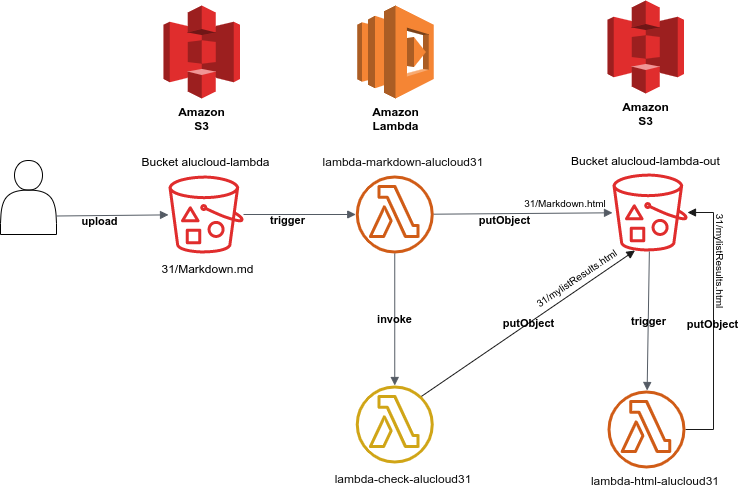
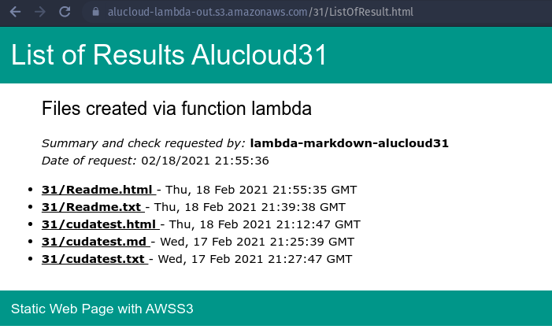
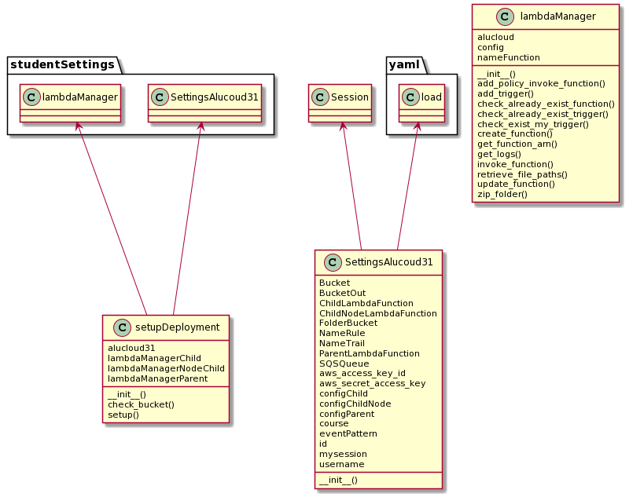
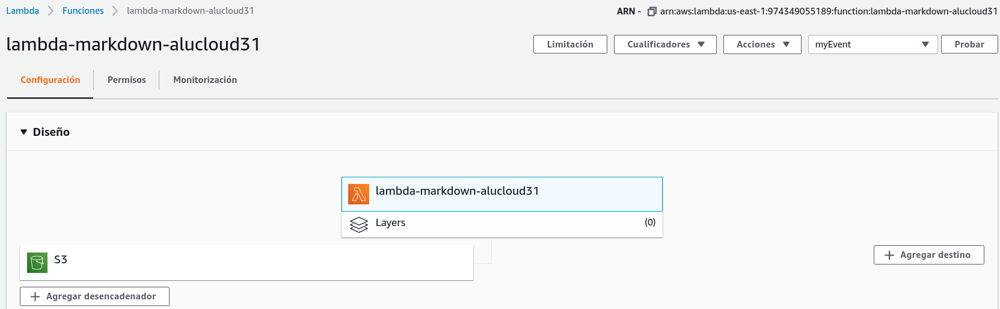
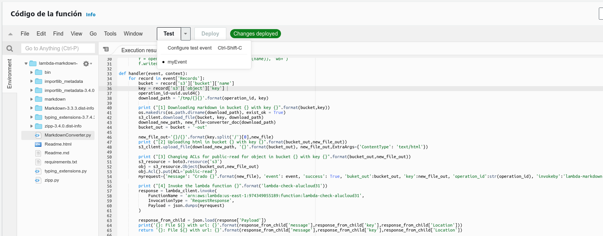
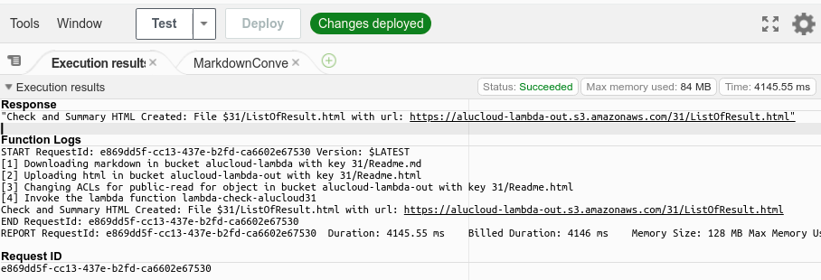
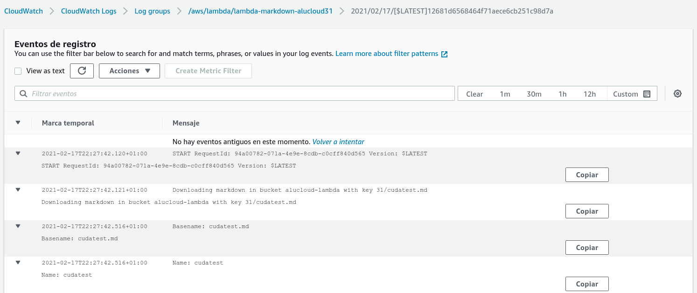
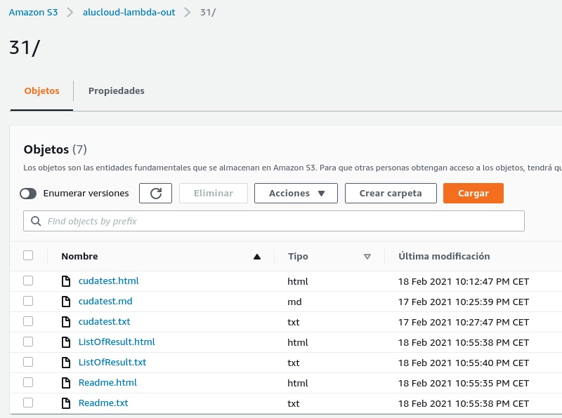

# Serverless Computing

## Abstract

It should be clarified that the name *serverless computing* can be misleading, it does not mean serverless computing, the "*less*" part of serverless is the opportunity for customers to not have to manage the server running their applications. In this paradigm, tasks are billed according to the real use of resources required by each specific application or task. 

Generally speaking, and focusing on the most basic use, **Serverless computing** provides the advantage of simplifying the process of deploying code in a production scenario. This lowers costs and speeds up deployment, with the cloud provider taking care of tasks such as scaling resources according to demand.

This document shows the development of AWS Lambda functions followed by an overview of the different functions, together with a graphical representation of both the AWS Lambda-based architecture and their interactions. 

## Objectives

The main objective of this work is to understand and learn how to use AWS Lambda in a more detailed way, along with the services involved to be carried out. AWS Lambda is a low-cost technology, that is why it is important to get the most out of it, and for this, there are other services that manage to provide greater advantages to this technology. 

To realise this main objective, three lambda functions are created that execute a specific task. In this particular case, one function is invoked when a file is uploaded in an S3 bucket and the result is saved in another S3 bucket, a second function is called by the invocation of the first lambda function and, finally, the third function is invoked by the event generated by the first function when its result is uploaded to an S3 bucket.   

## Methodology

In order to achieve the main objective, 3 lambda functions with different roles have been developed, where due to the result or invocation by one of the three functions, the other lambda functions are activated. 

These functions, along with any service implementation necessary for their operation, are created automatically by Python using the boto3 library. For the development of the functions, Python3 has been used together with boto3[^1]For two of them, being the last lambda function developed with Nodejs together with aws-sdk. 

[^1]: Amazon Web Services (AWS) SDK for Python, allowing you to create, configure and manage AWS services in Python

## Develop



A lambda function will be executed when a file with extension `.md` is uploaded to the S3 bucket **alucloud-lambda** in a folder (31 for this job) and it will download the file from the bucket, once downloaded it will convert it to an HTML file and then upload it **alucloud-lambda-out**. Finally it will invoke another function to update the result list of the conversions or tasks performed, providing the result via an updated static web page). 

In turn, uploading a file with extension `.html` to the **alucloud-lambda-out** bucket will trigger the execution of a third function. This will download the HTML file and filter all the content to obtain only the text, generating as a result a file with extension `.txt` that is uploaded to the **alucloud-lambda-out** bucket. 

### **Lambda functions** 

Before proceeding with each function, it is necessary to put into context the model followed in the programming of the lambda functions described above and detailed later. It is necessary to highlight the most relevant aspects that the three lambda functions share: 

- **Handler**: Function of the supplied code that the AWS Lambda service executes when the function is invoked. The event is passed as the first parameter and the *context* as the second parameter. 

- **Context**: Second parameter of the lambda function, used, for example, to obtain information that AWS lambda provides (time remaining before the function terminates) or to mark the completion of an asynchronous function by "*context.succeed('Completion message')*" (Used in languages such as Nodejs). 

- **Logging**: All messages displayed by standard output (e.g. *print, console.log, system.out.print*) will be transferred to CloudWatch Logs[^2], allowing them to be queried. 

  ^2]: CloudWatch Logs service for monitoring and storing log files and accessing them.

- **Stateless**: It is not assumed that the filesystem will be shared between invocations of the lambda function. Only /tmp has write permissions, the rest is read-only for the whole filesystem. 

In this work 3 lambda functions have been developed and will be detailed  below.

#### Master lambda function

It is called master since it will be in charge of performing the first action, triggering the invocation of the other two functions, either by call or by a new S3 event.  This function is named in AWS lambda as **lambda-markdown-alucloud31**. 

Below are the features of the function code:

##### Features

- Python 3.6 language
- markdown library to convert the file to html
- boto3 library to interact with AWS services (such as S3).

##### Functionality

This function is invoked when a Markdown (.md) file is uploaded to the alucloud-lambda bucket and performs the following steps:

1. Downloads the newly uploaded file
2. Converts it to HTML format
3. Uploads it to the *alucloud-lambda-out* bucket, generating a static web page (important to specify *Content-Type=text/html*)
4. Invokes the function called **lambda-check-alucloud31** with information about the event that invoked the function, the new uploaded file and information about the function itself (name, message, result ...)
5. Get the response message from the invoked lambda function.

The implementation code in the annex section A.1.


#### Child lambda function invoked

This function is named in AWS lambda as **lambda-check-alucloud31**, it is invoked by the previous function named **lambda-markdown-alucloud31**. The following interaction takes place between these two functions: 


This function has other different features from the previous one:

##### Características

- Nodejs12.x language
- fs library to handle Read/Write operations (Allows to perform these operations synchronously).
- aws-sdk library to interact with AWS services (such as S3).

As we can see, among the distinctive features is the language used. In this way, we see the flexibility that AWS Lambda offers and in the future allows this deployment using lambda functions not to be tied to the limitations of a single language.

##### Functionality

This function is invoked by the **lambda-markdown-alucloud31** function and executes the following steps:

1. Gets the message generated by the invoking function.

2. Checks all the modifications made on the bucket lambda-bucket-out in a folder specified by the message transmitted.
   
3. Make an HTML with the information it has received, generating a static web page.

4. Upload the new file to the alucloud-lambda-out bucket (specifying the content type '*text/html*').

The result is an HTML file that behaves as a static web page, allowing access to each of the files created:




#### Child lambda function

This function is named in AWS lambda as **lambda-html-alucloud31**, function invoked when it is detected as its name indicates, it is in charge of dealing with files with extension `.html`. Here are the features of the function's code:

##### Features

- Python 3.6 language
- html2text library to convert the HTML file to text (It also filters all the patterns of an `.html` file).
  HTML)
- boto3 library to interact with AWS services (such as S3).

##### Functionality

This function is invoked when an HTML file is uploaded to the alucloud-lambda-out bucket and consequently performs the following steps
Consequently, it performs the following steps:

1. Download the new file uploaded to the *alucloud-lambda-out* bucket.
2. Performs its reading and then filtering of the text.
3. The result is uploaded to the same bucket again maintaining the name, but with extension .txt.


### Creación y Lanzamiento

The following section shows and explains how the deployment has been implemented, describing the necessary elements or services, the steps to follow and the aspects to take into account. In addition, it is specified how the deployment has been carried out automatically with the help of Python together with the Boto3 library.

To perform the deployment it is necessary to have at your disposal:

- An AWS account, your credentials will be used to interact with AWS via Boto3.
- The buckets in S3 with the necessary permissions ( *alucloud-lambda* and *alucloud-lambda-cloud* in this case)
- A role with which the lambda function is executed, providing the access privileges to the lambda functions.

Based on the previous points, we begin to deploy the lambda functions. The following steps summarise the configuration followed:

- The first function **lambda-markdown-alucloud31** is checked to see if it exists, if not it is created.
- A new policy is now added to the function to allow it to be invoked by a *trigger* of the S3 service (the **arn** of the alucloud-lambda bucket in question must be specified).
- Now the "*trigger*" is added to be executed automatically on a "*PutObject*" event of the *alucloud-lambda* bucket.
- The "*trigger*" is created with the prefix "31/" and the suffix `.md`, before adding it we check that our trigger does not exist.
- It is time to add the function **lambda-html-alucloud31** if it does not exist.
- Add a new policy, to allow invocation by an S3 "*trigger*", but now indicated the bucket *alucloud- lambda -out*.
- The "*trigger*" is created with the prefix "31/" and suffix `.html`, specifying the bucket *alucloud-lambda-out*.
- Finally, the function **lambda-markdown-alucloud31** is created, following the same points of the previous function, but without adding the "*trigger*" for S3 events (*putObject*).
- Finally, just to allow this function to be invoked by another function, a new policy (*add new policy*) is added to allow this new function to be invoked by the **lambda-markdown-alucloud31** function (the **arn** of the invoking lambda function must be specified).


####  Implementación automática mediante script

To automatically deploy the above points, a series of Python scripts have been generated using the boto 3 library. Specifically, two Python files have been created, one of which provides the appropriate configuration and the other the functions to carry out each of the steps. 

The following class diagram illustrates the structure and methodology used:



As the diagram shows there are three classes:

- **setupDeployment** created in the file `init-deployment.py`
- **SettingsAlucloud31** located in the file `studentSettings.py` 
- LambdaManager** located in the file `studentSettings.py` 

**SettingsAlucloud31**, contains the configuration with all the names of the services or elements involved, as well as the session of our AWS account and the configuration of each lambda function in YAML format:

```yaml
self.configParent=yaml.load("""
            role: myrole
            name: lambda-markdown-alucloud31
            zip: lambda-markdown-alucloud31.zip
            path: parent-lambda-code
            handler: MarkdownConverter.handler
            runtime: python3.6
            description: Convert mardownk documents to html
            suffix: .md
            statementid: '1-lambda'
            bucket: {}
            arn_bucket: arn:aws:s3:::alucloud-lambda
            """.format(self.Bucket), 
            Loader=yaml.FullLoader)
            
 self.configChild=yaml.load("""
            ......
            """.format(self.BucketOut), 
            Loader=yaml.FullLoader)

 self.configChildNode=yaml.load("""
           ......
            """.format(self.BucketOut), 
            Loader=yaml.FullLoader)
```


**LambdaManager**, in charge of providing a series of functionalities to perform the deployment. It is instantiated by passing as parameter the instance of the previous class (*SettingsAlucloud31*), as well as the desired lambda configuration. Below is a code snippet to exemplify:

```python
self.lambdaManagerParent=studentSettings.lambdaManager(self.alucloud31,self.alucloud31.configParent)

#Child is invoked when Parent putObject type .html tu Bucket S3
self.lambdaManagerChild=studentSettings.lambdaManager(self.alucloud31,self.alucloud31.configChild)

#Node Child is invoked by parent when he finish the task
self.lambdaManagerNodeChild=studentSettings.lambdaManager(self.alucloud31,self.alucloud31.configChildNode)
```

For each function, a new **LambdaManager** class is instantiated to facilitate the individual management of each function.

**setupDeployment**, is the class in charge of starting the deployment using the class *LambdaManager* to handle each function and *SettingsAlucloud31* to establish the necessary configuration. The following is an example of how to launch or initialise the deployment:

```sh
$ init-deployment.py --Init
```
If the start-up has been successful, the next output is shown.
```c#
[SUCCES] QUEUE sqs-alucloud31 exist
[SUCCES] RULE alucloud-events-rule-s3-to-sqs-31 exist
[SUCCES] FOLDER (31/) on BUCKET (alucloud-lambda)
[SUCCES] FUNCTION LAMBDA(lambda-markdown-alucloud31) exist
[SUCCES] TRIGGER ON BUCKET(alucloud-lambda) exist
[INFO] CHECK OUR TRIGGER ON BUCKET(alucloud-lambda-out) exist
[SUCCES] TRIGGER ON BUCKET(alucloud-lambda) exist
[SUCCES] FUNCTION LAMBDA(lambda-html-alucloud31) exist
[INFO] TRIGGER ON BUCKET(alucloud-lambda-out) exist
[INFO] CHECK OUR TRIGGER ON BUCKET(alucloud-lambda-out) exist
[SUCCES] TRIGGER ON BUCKET(alucloud-lambda) exist
[SUCCES] FUNCTION LAMBDA(lambda-html-alucloud31) exist
```

In addition, there are other parameters that can be scaled in the future, for example, the visualisation of the records generated by each of the functions in the last 24 hours is implemented. To display the available parameters:
```sh
$ init-deployment.py -h

usage: init-deployment.py [-h] [-i INIT] [-l]

optional arguments:
  -h, --help            show this help message and exit
  -i INIT, --Init INIT  Launch the developed setup
  -l, --Logs            Display the logs of each lambda function deployed.
```
### Results achieved

Below are images of AWS Management Console[[4]](#1), these are the result of the deployment obtained:

**Deployed Lambda Functions:**




### Testing

In this section, a series of tests are carried out to verify the correct functioning of the deployment. To do so, a series of steps are followed to verify its adequate functioning.

##### Invocation of the lambda function lambda-markdown-alucloud31

```sh
aws lambda invoke \
--invocation-type Event \
--function-name lambda-markdown-alucloud31 \
--region us-east-1 \
--payload file://${PWD}/test_deployment_parent.json \
outputfile.txt
#Successful output: 202
```

Records Generated by the invocation:

```sh
LOG_GROUP=/aws/lambda/lambda-markdown-alucloud31
aws logs get-log-events --log-group-name $LOG_GROUP --log-stream-name `aws logs describe-log-streams --log-group-name $LOG_GROUP --max-items 1 --order-by LastEventTime --descending --query logStreams[].logStreamName --output text | head -n 1` --query events[].message --output text

## Succellfull output
START RequestId: e869dd5f-cc13-437e-b2fd-ca6602e67530 Version: $LATEST
[1] Downloading markdown in bucket alucloud-lambda with key 31/Readme.md
[2] Uploading html in bucket alucloud-lambda-out with key 31/Readme.html
[3] Changing ACLs for public-read for object in bucket alucloud-lambda-out with key 31/Readme.html
[4] Invoke the lambda function lambda-check-alucloud31
Check and Summary HTML Created: File $31/ListOfResult.html with url: https://alucloud-lambda-out.s3.amazonaws.com/31/ListOfResult.html
END RequestId: e869dd5f-cc13-437e-b2fd-ca6602e67530
REPORT RequestId: e869dd5f-cc13-437e-b2fd-ca6602e67530	Duration: 4145.55 ms	Billed Duration: 4146 ms	Memory Size: 128 MB	Max Memory Used: 84 MB	Init Duration: 509.80 ms
```

Here it is shown how by commands we can invoke an event, using a created event template. A different template has been created for each event created.

These templates can also be launched from the AWS Management Console, as shown in the following image: 



As a result of the execution:




##### Uploading a file to S3 and displaying the generated event

```sh
aws s3 cp ${PWD}/example-data/cuda.md s3://alucloud-lambda/$ID/cudatest.md
# Successful output: 
#   upload: example-data/cuda.md to s3://alucloud-lambda-out/31/cudatest.md
```

The file is now listed in the new bucket:

```sh
aws s3 ls s3://alucloud-lambda-out/$ID/  | grep --color=always 'cuda'
#Successful output:
#   2021-02-17 21:10:22      13197 cudatest.md
```

Finally, this new upload has caused the invocation of the lambda function **lambda-markdown-alucloud31**, now it proceeds to display the last records (*logs*) of this function.

```sh
LOG_GROUP=/aws/lambda/lambda-markdown-alucloud31
aws logs get-log-events --log-group-name $LOG_GROUP --log-stream-name `aws logs describe-log-streams --log-group-name $LOG_GROUP --max-items 1 --order-by LastEventTime --descending --query logStreams[].logStreamName --output text | head -n 1` --query events[].message --output text

## Succellfull output
START RequestId: e869dd5f-cc13-437e-b2fd-ca6602e67530 Version: $LATEST
[1] Downloading markdown in bucket alucloud-lambda with key 31/cudatest.md
[2] Uploading html in bucket alucloud-lambda-out with key 31/cudatest.html
[3] Changing ACLs for public-read for object in bucket alucloud-lambda-out with key 31/cudatest.html
[4] Invoke the lambda function lambda-check-alucloud31
Check and Summary HTML Created: File $31/ListOfResult.html with url: https://alucloud-lambda-out.s3.amazonaws.com/31/ListOfResult.html
END RequestId: e869dd5f-cc13-437e-b2fd-ca6602e67530
REPORT RequestId: e869dd5f-cc13-437e-b2fd-ca6602e67530	Duration: 4145.55 ms	Billed Duration: 4146 ms	Memory Size: 128 MB	Max Memory Used: 84 MB	Init Duration: 509.80 ms
```

It can also be viewed directly from the AWS Management Console at the following address, CloudWatch Logs > Log groups > /aws/lambda/lambda-markdown-alucloud-31:



If the logs are observed in detail, the function **lambda-check-alucloud31** has worked satisfactorily, since it has answered the invocation of the tested function. Below is the line representing the response of the **lambda-check-alucloud31** function.

```sh
Check and Summary HTML Created: File $31/ListOfResult.html with url: https://alucloud-lambda-out.s3.amazonaws.com/31/ListOfResult.html
```

##### Invocation of the lambda function lambda-html-alucloud31

```sh
aws lambda invoke \
--invocation-type Event \
--function-name lambda-html-alucloud31 \
--region us-east-1 \
--payload file://${PWD}/test_deployment_child.json \
outputfile.txt
#Successful output: 202
```
Once the event has been successfully launched, it is time to display the latest logs from the of the function.

```sh
LOG_GROUP=/aws/lambda/lambda-html-alucloud31
aws logs get-log-events --log-group-name $LOG_GROUP --log-stream-name `aws logs describe-log-streams --log-group-name $LOG_GROUP --max-items 1 --order-by LastEventTime --descending --query logStreams[].logStreamName --output text | head -n 1` --query events[].message --output text
## Succellfull output
START RequestId: 1029f3e5-3848-44c8-9316-64fa973ca0c2 Version: $LATEST
	[1] Downloading markdown in bucket alucloud-lambda-out with key 31/Readme.html
	[2] Uploading html in bucket alucloud-lambda-out with key 31/Readme.txt
	[3] Changing ACLs for public-read for object in bucket alucloud-lambda-out with key 31/Readme.txt
	END RequestId: 1029f3e5-3848-44c8-9316-64fa973ca0c2
	REPORT RequestId: 1029f3e5-3848-44c8-9316-64fa973ca0c2	Duration: 1462.16 ms	Billed Duration: 1463 ms	Memory Size: 128 MB	Max Memory Used: 78 MB	Init Duration: 477.93 ms	
```

To finalise the tests and confirm correct operation, the result is showed with screenshots of the AWS Management Console interface:



## Future improvements

The initial intention was to be able to convert a ".doc" file to PDF with Python, but due to the need to work with Windows this has not been possible. In addition, the existing libraries for converting other types of documents to PDF use other "sub-libraries", so when compressing the code to be sent to AWS, there is always an error because some library is not detected. Therefore, for this work we have used lighter libraries with fewer dependencies, thus allowing the possibility of testing and modifying the function from the AWS Management Console platform itself. 

For the near future, it is possible to address each of the dependencies or select another language, such as NodeJs, which is used in this work.


## References
<a id="1">[1]</a> 
[Microsoft azure](https://docs.microsoft.com/en-us/azure/?product=featured)
Microsoft Azure: Cloud Computing Services

<a id="1">[2]</a> 
[Google Cloud](https://cloud.google.com)
Google Cloud Service

<a id="1">[3]</a> 
[IBM Cloud Functions](https://cloud.ibm.com/functions/)
Function-as-a-Service (FaaS) platform based on Apache OpenWhisk

<a id="1">[4]</a> 
[AWS Management Console](https://aws.amazon.com/es/console/)
AWS Management Console

<a id="1">[5]</a> 
[Serverless Computing](https://www.ibm.com/cloud/learn/serverless)
What is serverless computing?